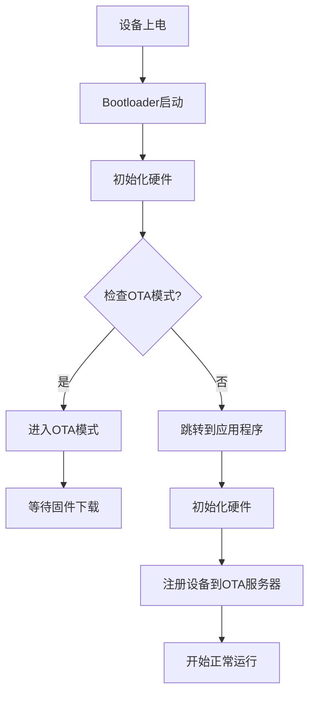
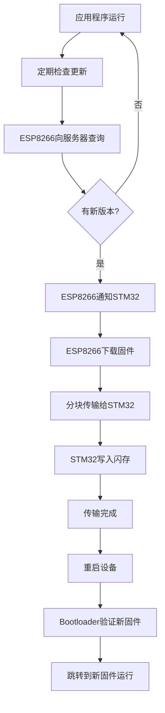
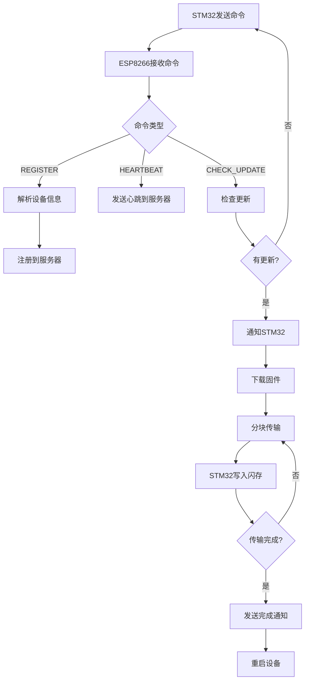

# STM32 ESP8266 OTA 项目流程

## 项目概述

本项目实现了基于STM32F103C8T6微控制器和ESP8266 WiFi模块的OTA（Over-The-Air）固件更新功能。通过此功能，设备可以通过网络远程更新固件，无需物理连接。

## 硬件组成

- **STM32F103C8T6**：主微控制器，运行用户应用程序
- **ESP8266**：WiFi模块，负责网络通信和固件下载
- **LED**：状态指示
- **串口连接**：STM32与ESP8266之间通过UART串口通信

## 软件架构

### 1. 目录结构

```
stm32_esp8266_ota/
├── esp8266/            # ESP8266代码
│   ├── src/
│   │   └── main.cpp    # ESP8266主程序
│   └── platformio.ini  # PlatformIO配置文件
├── stm32/              # STM32代码
│   ├── Core/           # 核心应用代码
│   │   ├── Inc/
│   │   │   └── main.h  # 主头文件
│   │   └── Src/
│   │       ├── main.c  # 应用主程序
│   │       └── system_stm32f1xx.c  # 系统时钟配置
│   ├── bootloader/     # Bootloader代码
│   │   ├── Inc/
│   │   │   └── bootloader.h  # Bootloader头文件
│   │   └── Src/
│   │       └── bootloader.c  # Bootloader实现
│   └── ota/            # OTA配置
│       └── ota_config.h  # OTA配置文件
└── README.md           # 项目说明
```

### 2. 核心组件

#### 2.1 Bootloader
- 负责启动时检查是否需要进入OTA模式
- 实现固件下载和闪存写入
- 完成后跳转到应用程序

#### 2.2 应用程序
- 正常运行用户功能
- 定期检查固件更新
- 与ESP8266通信，接收更新指令

#### 2.3 ESP8266模块
- 连接WiFi网络
- 与OTA服务器通信
- 下载固件并传输给STM32

## 工作流程

### 1. 设备启动流程



1. **Bootloader启动**
   - 初始化硬件（GPIO、串口）
   - 检查是否需要进入OTA模式（可通过GPIO触发）
   - 如果需要OTA，进入OTA模式等待固件下载
   - 如果不需要OTA，跳转到应用程序

2. **应用程序启动**
   - 初始化硬件
   - 注册设备到OTA服务器
   - 开始正常运行

### 2. 固件更新流程



1. **检查更新**
   - 应用程序定期发送检查更新请求
   - ESP8266向OTA服务器查询最新固件版本
   - 如果有新版本，通知应用程序

2. **固件下载**
   - ESP8266从服务器下载固件
   - 分块传输给STM32
   - STM32写入闪存

3. **更新完成**
   - 下载完成后重启设备
   - Bootloader验证新固件
   - 跳转到新固件运行

### 3. 数据传输流程



### 4. 通信协议

#### 4.1 STM32 → ESP8266 命令

| 命令 | 格式 | 说明 |
|------|------|------|
| 注册 | `REGISTER:设备ID,设备类型,当前版本` | 注册设备到OTA系统 |
| 心跳 | `HEARTBEAT` | 保持设备在线状态 |
| 检查更新 | `CHECK_UPDATE` | 检查是否有新固件 |

#### 4.2 ESP8266 → STM32 响应

| 响应 | 说明 |
|------|------|
| `UPDATE_AVAILABLE` | 有新固件可用 |
| `FIRMWARE_SIZE,大小` | 固件大小 |
| `DOWNLOAD_COMPLETE` | 固件下载完成 |
| `DOWNLOAD_FAILED` | 固件下载失败 |

## 代码实现

### 1. STM32应用程序（main.c）

- 初始化硬件和串口
- 注册设备到OTA系统
- 定期发送心跳包和检查更新
- 处理ESP8266的响应
- 实现LED闪烁功能

### 2. Bootloader（bootloader.c）

- 初始化硬件
- 检查启动模式
- 实现固件数据接收和闪存写入
- 实现应用程序跳转

### 3. ESP8266代码（main.cpp）

- 连接WiFi网络
- 与STM32通信
- 与OTA服务器通信
- 下载固件并传输给STM32

## 使用说明

### 1. 硬件连接

- STM32的USART1（PA9-TX, PA10-RX）连接到ESP8266的串口
- STM32的GPIOC13连接LED
- ESP8266连接到WiFi网络

### 2. 配置

- 修改ESP8266代码中的WiFi SSID和密码
- 修改OTA服务器地址
- 修改设备ID和类型

### 3. 编译和烧录

#### 3.1 ESP8266

使用PlatformIO编译和烧录：

```bash
cd esp8266
platformio run --target upload
```

#### 3.2 STM32

- 编译Bootloader和应用程序
- 先烧录Bootloader到0x08000000
- 再烧录应用程序到0x08004000

### 4. OTA服务器

- 部署OTA服务器（如本项目的Flask服务器）
- 上传固件到服务器
- 设备将自动检查和下载更新

## 注意事项

1. **Bootloader大小**：Bootloader占用前16KB闪存（0x08000000-0x08003FFF），应用程序从0x08004000开始

2. **固件格式**：固件必须是二进制格式，且大小不超过112KB

3. **通信稳定性**：确保STM32与ESP8266之间的串口通信稳定

4. **电源供应**：确保设备有足够的电源供应，特别是在固件下载和写入过程中

5. **错误处理**：系统包含基本的错误处理，但在实际应用中可能需要更完善的错误处理机制

## 故障排除

### 1. 设备无法连接WiFi
- 检查WiFi SSID和密码是否正确
- 检查ESP8266的硬件连接

### 2. 固件下载失败
- 检查网络连接
- 检查OTA服务器是否正常运行
- 检查固件文件是否存在且可访问

### 3. 设备无法启动应用程序
- 检查应用程序是否正确烧录
- 检查Bootloader是否正常工作
- 检查闪存是否有损坏

## 扩展功能

1. **远程控制**：可以通过OTA服务器发送控制命令到设备

2. **传感器数据上传**：可以添加传感器，将数据上传到服务器

3. **多设备管理**：可以扩展为管理多个设备的OTA系统

4. **加密通信**：可以添加通信加密，提高安全性

## 总结

本项目实现了一个完整的基于STM32和ESP8266的OTA固件更新系统，具有以下特点：

- 使用标准库实现，不依赖HAL库
- 模块化设计，结构清晰
- 支持远程固件更新
- 具有基本的错误处理和状态指示

该系统可以应用于需要远程维护和更新的嵌入式设备，如智能家居设备、工业控制器等。